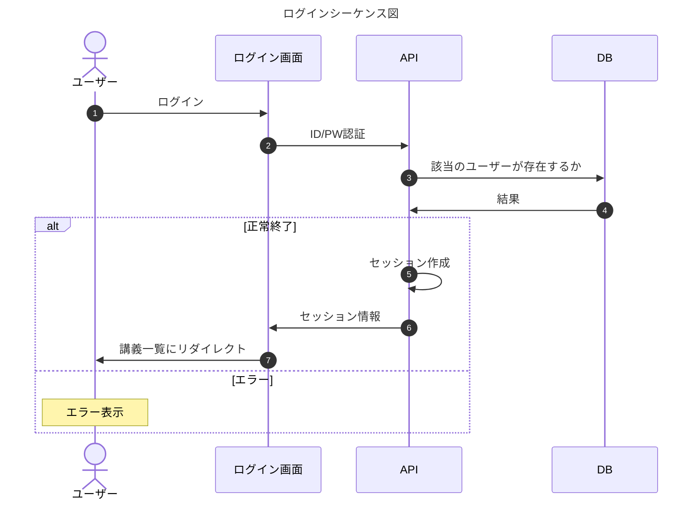
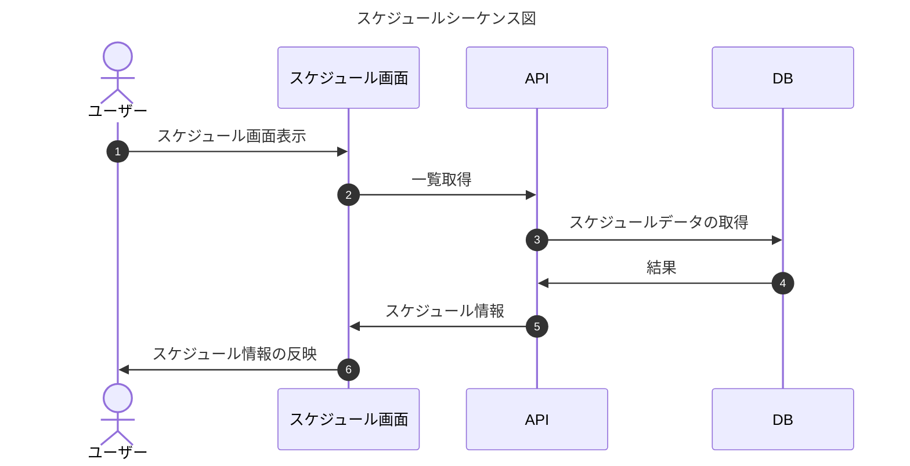

# API

| パス                  | メソッド | 概要           |
| --------------------- | -------- | -------------- |
| /user/login           | POST     | ログイン       |
| /user/logout          | GET      | ログアウト     |
| /user/change_password | PUT      | パスワード変更 |

- ログイン
- ログアウト
- パスワード変更
- スケジュール
  - 一覧
  - 詳細
  - 変更
  - 削除
  - 登録
- 講義一覧

## シーケンス図

### ログイン

### スケジュール一覧

