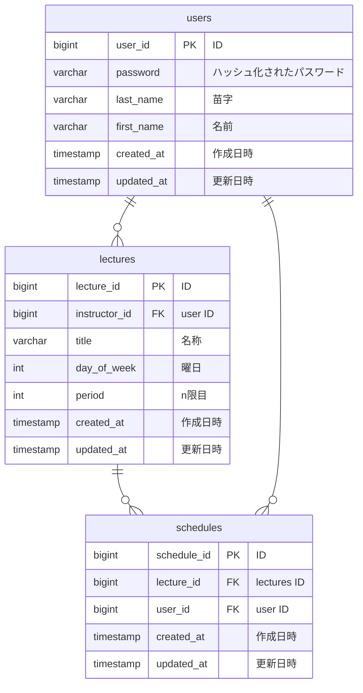

# ER図

```mermaid
erDiagram
    lectures ||--o{ schedules : ""
    users ||--o{ schedules : ""
    users ||--o{ lectures : ""

    users {
        bigint user_id PK "ID"
        varchar password "ハッシュ化されたパスワード"
        varchar last_name "苗字"
        varchar first_name "名前"
        timestamp created_at "作成日時"
        timestamp updated_at "更新日時"
    }

    lectures {
        bigint lecture_id PK "ID"
        bigint instructor_id FK "user ID"
        varchar title "名称"
        int day_of_week "曜日"
        int period "n限目"
        timestamp created_at "作成日時"
        timestamp updated_at "更新日時"
    }

    schedules {
        bigint schedule_id PK "ID"
        bigint lecture_id FK "lectures ID"
        bigint user_id FK "user ID"
        timestamp created_at "作成日時"
        timestamp updated_at "更新日時"
    }
```