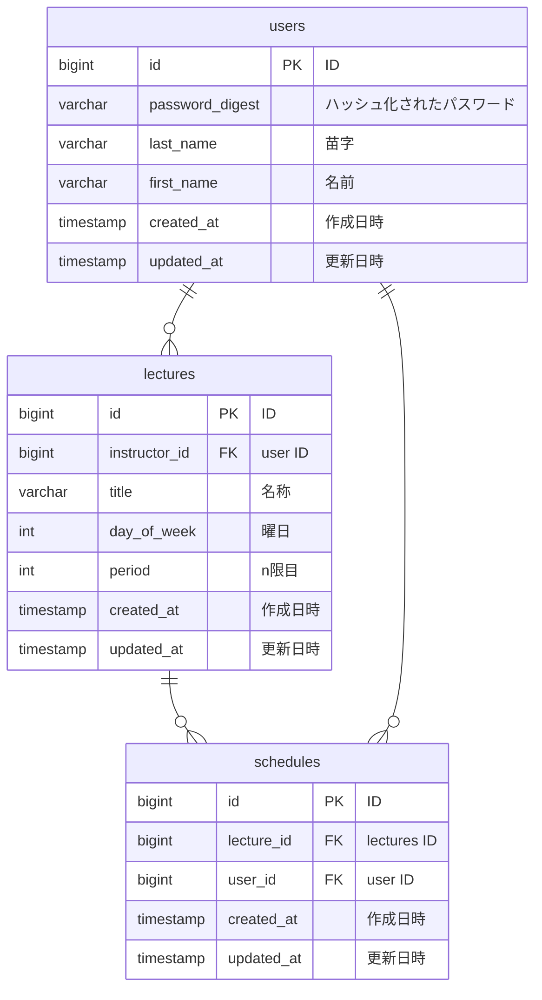

# ER 図

lectures テーブルの day_of_week は曜日、period は n限目を表す

|        | day_of_week | 1   | 2    | 3    | 4   | 5    | 6   |
| ------ | ----------- | --- | ---- | ---- | --- | ---- | --- |
| period |             | 月  | 火   | 水   | 木  | 金   | 土  |
| 1      | 1限目       |     |      |      |     |      |     |
| 2      | 2限目       |     | 数学 |      |     |      |     |
| 3      | 3限目       |     |      | 物理 |     |      |     |
| 4      | 4限目       |     |      |      |     |      |     |
| 5      | 5限目       |     |      |      |     | 社会 |     |
| 6      | 6限目       |     |      |      |     |      |     |
